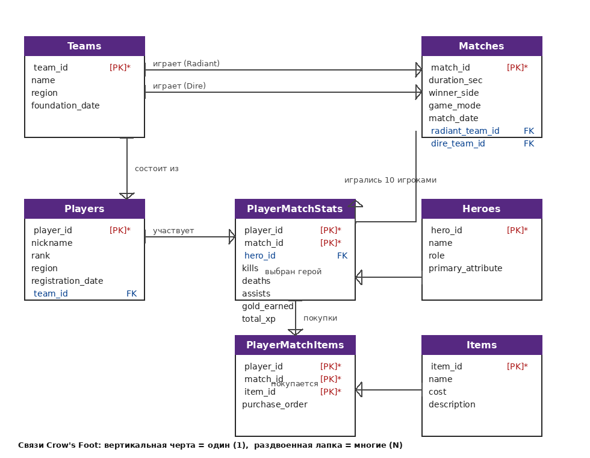

# Домашняя работа 1 — Проектирование базы данных

**Предметная область:** киберспортивная дисциплина Dota 2
**СУБД:** PostgreSQL

## 1. Описание предметной области

База данных хранит информацию об игроках, командах, матчах, героях и предметах Dota 2.
Каждый матч связывается с двумя командами (Radiant и Dire), а внутри матча каждый игрок
получает строку статистики (убийства, смерти, ассисты, золото, опыт) и выбирает героя.
Отдельно фиксируются предметы, которые игрок купил по ходу матча. Это позволяет отвечать
на аналитические вопросы: на каком герое игрок показывает лучшую статистику, какие команды
чаще побеждают и т.д.

## 2. Сущности

| Сущность            | Назначение                                                        |
|---------------------|-------------------------------------------------------------------|
| `Teams`             | Киберспортивные команды                                           |
| `Players`           | Игроки, принадлежащие командам                                    |
| `Matches`           | Матчи между командами Radiant и Dire                              |
| `Heroes`            | Герои, доступные для выбора в матче                               |
| `Items`             | Предметы, которые можно купить в игре                             |
| `PlayerMatchStats`  | Связка: статистика конкретного игрока в конкретном матче (герой, K/D/A, золото, опыт) |
| `PlayerMatchItems`  | Связка: предметы, купленные игроком в конкретном матче            |

## 3. ER-диаграмма (нотация Crow's Foot)



Кардинальность связей:

| От                              | К                                | Тип связи       |
|---------------------------------|----------------------------------|-----------------|
| `Teams`                         | `Players`                        | 1 : N           |
| `Teams` (как Radiant)           | `Matches`                        | 1 : N           |
| `Teams` (как Dire)              | `Matches`                        | 1 : N           |
| `Players`                       | `PlayerMatchStats`               | 1 : N           |
| `Matches`                       | `PlayerMatchStats`               | 1 : N           |
| `Heroes`                        | `PlayerMatchStats`               | 1 : N           |
| `PlayerMatchStats`              | `PlayerMatchItems`               | 1 : N           |
| `Items`                         | `PlayerMatchItems`               | 1 : N           |

## 4. SQL-схема (PostgreSQL)

```sql
-- Сущность: Команды
CREATE TABLE Teams (
    team_id         SERIAL PRIMARY KEY,
    name            VARCHAR(50)  NOT NULL UNIQUE,
    region          VARCHAR(30),
    foundation_date DATE
);

-- Сущность: Игроки
CREATE TABLE Players (
    player_id         SERIAL PRIMARY KEY,
    nickname          VARCHAR(30) NOT NULL UNIQUE,
    rank              VARCHAR(20) NOT NULL,
    region            VARCHAR(30),
    registration_date DATE        NOT NULL DEFAULT CURRENT_DATE,
    team_id           INT         REFERENCES Teams(team_id)
);

-- Сущность: Герои
CREATE TABLE Heroes (
    hero_id           SERIAL PRIMARY KEY,
    name              VARCHAR(30) NOT NULL UNIQUE,
    role              VARCHAR(40),
    primary_attribute VARCHAR(10) NOT NULL -- STR / AGI / INT
);

-- Сущность: Матчи
CREATE TABLE Matches (
    match_id        SERIAL PRIMARY KEY,
    duration_sec    INT      NOT NULL,
    winner_side     VARCHAR(7) NOT NULL CHECK (winner_side IN ('Radiant', 'Dire')),
    game_mode       VARCHAR(30),
    match_date      DATE     NOT NULL DEFAULT CURRENT_DATE,
    radiant_team_id INT      REFERENCES Teams(team_id),
    dire_team_id    INT      REFERENCES Teams(team_id)
);

-- Сущность: Предметы
CREATE TABLE Items (
    item_id     SERIAL PRIMARY KEY,
    name        VARCHAR(40) NOT NULL UNIQUE,
    cost        INT  NOT NULL CHECK (cost >= 0),
    description TEXT
);

-- Сущность: Статистика игрока в матче
CREATE TABLE PlayerMatchStats (
    player_id   INT REFERENCES Players(player_id),
    match_id    INT REFERENCES Matches(match_id),
    hero_id     INT REFERENCES Heroes(hero_id),
    kills       INT NOT NULL,
    deaths      INT NOT NULL,
    assists     INT NOT NULL,
    gold_earned INT NOT NULL,
    total_xp    INT NOT NULL,
    PRIMARY KEY (player_id, match_id)
);

-- Сущность: Предметы, купленные игроком в матче
CREATE TABLE PlayerMatchItems (
    player_id      INT,
    match_id       INT,
    item_id        INT REFERENCES Items(item_id),
    purchase_order INT NOT NULL,
    PRIMARY KEY (player_id, match_id, item_id),
    FOREIGN KEY (player_id, match_id)
        REFERENCES PlayerMatchStats (player_id, match_id)
);
```

## 5. Запросы на реляционной алгебре

### Запрос 1. Операции выбора σ и проекции π

**Формулировка на естественном языке:**
Найти никнеймы и ранги всех игроков из Европы (`region = 'Europe'`), чей ранг — `Divine` или `Immortal`.

**Запись на реляционной алгебре:**

```
π nickname, rank (
    σ region = 'Europe' AND (rank = 'Divine' OR rank = 'Immortal') (Players)
)
```

**Пояснение:**
1. Операция выбора σ отбирает строки, удовлетворяющие условию (регион Европа,
   ранг Divine или Immortal).
2. Операция проекции π оставляет только нужные атрибуты `nickname` и `rank`.

### Запрос 2. Операция соединения ⋈

**Формулировка на естественном языке:**
Найти никнеймы игроков, которые сыграли в матче героем `Invoker` и набрали более 10 убийств.

**Запись на реляционной алгебре:**

```
π nickname (
    σ name = 'Invoker' AND kills > 10 (
        Players ⋈ PlayerMatchStats ⋈ Heroes
    )
)
```

**Пояснение:**
1. Отношение `PlayerMatchStats` соединяется с `Players` по `player_id`
   (естественное соединение) и с `Heroes` по `hero_id`.
2. Операция σ оставляет строки только тех матчей, где герой — `Invoker` и убийств больше 10.
3. Операция π выводит никнеймы таких игроков.