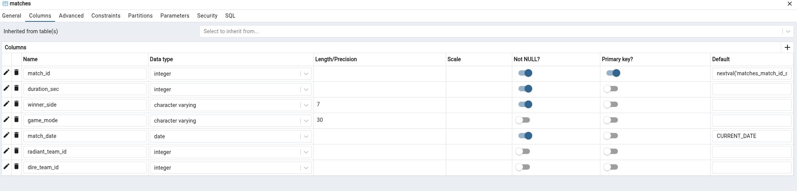
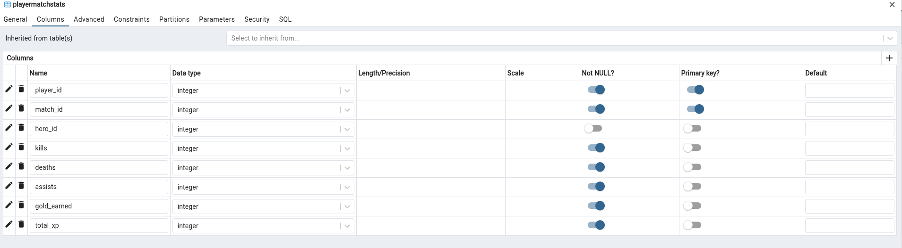
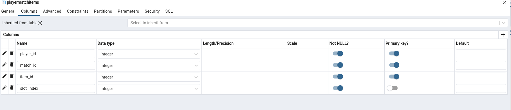
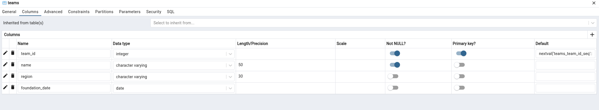
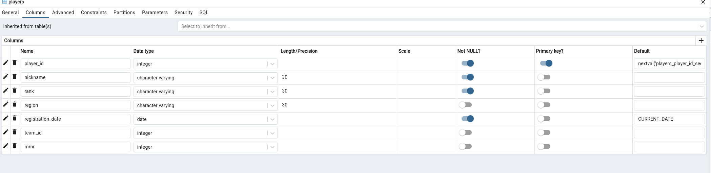
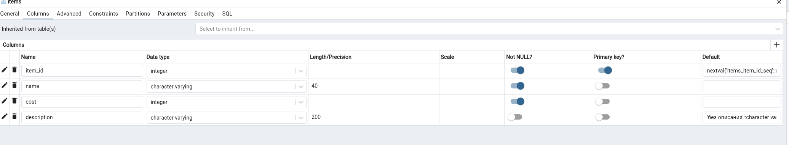
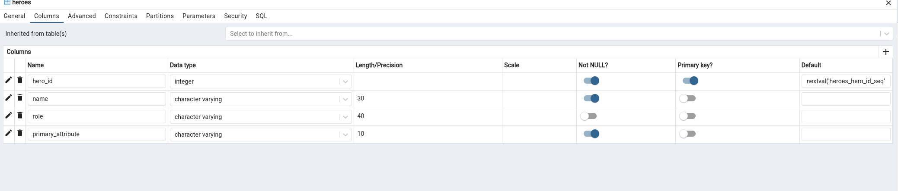

# Домашняя работа 2 — Работа с таблицами в PostgreSQL

**Предметная область:** Dota 2 (продолжение HW1)
**СУБД:** PostgreSQL 16
**База данных:** `dota2_hw`

## Цель работы

На основе ER-диаграммы из HW1:
1. Создать таблицы (CREATE TABLE).
2. Изменить структуру таблиц (5 ALTER-запросов).
3. Заполнить таблицы тестовыми данными (3–5 записей на таблицу).
4. Изменить данные (5 UPDATE-запросов).
5. Предоставить вывод структуры таблиц из СУБД (файлы в `output/`).

## Файлы работы

```
HW2/
├── README.md                 — данный отчёт
├── create_tables.sql         — этап 1: создание 7 таблиц
├── alter_tables.sql          — этап 2: 5 запросов ALTER TABLE
├── insert_data.sql           — этап 3: заполнение таблиц (INSERT)
├── update_data.sql           — этап 4: изменение данных (UPDATE)
└── output/                   — «скриншоты» структуры и данных из СУБД
    ├── structure_after_create.txt   — структура таблиц после CREATE
    ├── structure_after_alter.txt    — структура таблиц после ALTER
    ├── data_after_insert.txt        — содержимое после INSERT
    ├── data_after_update.txt        — содержимое после UPDATE
    └── screenshots/                 — скриншоты pgAdmin (структура каждой таблицы)
```

## Этап 1. Создание таблиц

Скрипт `create_tables.sql` создаёт 7 таблиц в соответствии с ER-диаграммой HW1.
Для повторного запуска в начале выполняется `DROP TABLE ... CASCADE`.

| Таблица | Первичный ключ | Внешние ключи |
|---|---|---|
| `Teams` | `team_id` | — |
| `Players` | `player_id` | `team_id → Teams` |
| `Heroes` | `hero_id` | — |
| `Matches` | `match_id` | `radiant_team_id → Teams`, `dire_team_id → Teams` |
| `Items` | `item_id` | — |
| `PlayerMatchStats` | `(player_id, match_id)` | `player_id → Players`, `match_id → Matches`, `hero_id → Heroes` |
| `PlayerMatchItems` | `(player_id, match_id, item_id)` | `(player_id, match_id) → PlayerMatchStats`, `item_id → Items` |

## Этап 2. Изменение структуры таблиц (5 ALTER-запросов)

```sql
-- 1) Добавляем новый столбец mmr (рейтинг MMR игрока)
ALTER TABLE Players
    ADD COLUMN mmr INT;

-- 2) Расширяем тип столбца rank: VARCHAR(20) -> VARCHAR(30)
ALTER TABLE Players
    ALTER COLUMN rank TYPE VARCHAR(30);

-- 3) Переименовываем столбец purchase_order -> slot_index
ALTER TABLE PlayerMatchItems
    RENAME COLUMN purchase_order TO slot_index;

-- 4) Добавляем ограничение CHECK: убийства не могут быть отрицательными
ALTER TABLE PlayerMatchStats
    ADD CONSTRAINT check_kills_non_negative CHECK (kills >= 0);

-- 5) Уточняем тип и добавляем значение по умолчанию для описания предмета
ALTER TABLE Items
    ALTER COLUMN description TYPE VARCHAR(200);
ALTER TABLE Items
    ALTER COLUMN description SET DEFAULT 'без описания';
```

Все изменения подтверждены структурой таблиц из СУБД
(см. `output/structure_after_alter.txt`).

## Этап 3. Заполнение таблиц (INSERT)

Для каждой таблицы вставлено от 4 до 5 записей:

| Таблица | Кол-во записей | Пример данных |
|---|---|---|
| `Teams` | 4 | Team Spirit, Team Secret, PSG.LGD, Team Liquid |
| `Players` | 5 | Yatoro, Collapse, Miposhka, Puppey, Ame |
| `Heroes` | 5 | Invoker, Anti-Mage, Pudge, Crystal Maiden, Faceless Void |
| `Matches` | 4 | матчи между командами (Radiant/Dire) |
| `Items` | 5 | Black King Bar, Aghanim's Scepter, Blink Dagger и др. |
| `PlayerMatchStats` | 5 | статистика игроков в матчах (K/D/A, золото, опыт) |
| `PlayerMatchItems` | 5 | купленные предметы с порядком покупки |

Порядок вставки соблюдает внешние ключи:
`Teams → Players/Matches/Items/... → PlayerMatchStats → PlayerMatchItems`.

## Этап 4. Изменение данных (5 UPDATE-запросов)

```sql
-- 1) Повышаем рейтинг и ранг игрока Yatoro
UPDATE Players
SET rank = 'Immortal', mmr = 12500
WHERE nickname = 'Yatoro';

-- 2) Исправляем ошибку: в матче №2 победила сторона Dire
UPDATE Matches
SET winner_side = 'Dire'
WHERE match_id = 2;

-- 3) Повышаем цену предмета Tango на 10 золота
UPDATE Items
SET cost = cost + 10
WHERE name = 'Tango';

-- 4) Увеличиваем количество убийств игрока Collapse в матче №1
UPDATE PlayerMatchStats
SET kills = kills + 1
WHERE player_id = 2 AND match_id = 1;

-- 5) Меняем регион команды Team Secret
UPDATE Teams
SET region = 'Western Europe (EU)'
WHERE name = 'Team Secret';
```

Дополнительно новый столбец `mmr` заполнен значением по умолчанию для остальных игроков:

```sql
UPDATE Players SET mmr = 9800 WHERE mmr IS NULL;
```

Различия между `output/data_after_insert.txt` и `output/data_after_update.txt`
наглядно показывают результат каждого UPDATE.

## Этап 5. Скриншоты структуры таблиц в СУБД

Скриншоты сделаны в pgAdmin 4 (вкладка «Columns» окна Properties каждой таблицы):















Оригиналы скриншотов лежат в `output/screenshots/`.

Дополнительно текстовый вывод psql (`\d+` и `SELECT *`) сохранён в `output/`:
- `output/structure_after_create.txt` — структура после CREATE TABLE
- `output/structure_after_alter.txt`  — структура после ALTER TABLE
- `output/data_after_insert.txt`      — данные после INSERT
- `output/data_after_update.txt`      — данные после UPDATE

## Как воспроизвести

```bash
psql -h 127.0.0.1 -U timerlan -d dota2_hw -f create_tables.sql
psql -h 127.0.0.1 -U timerlan -d dota2_hw -f alter_tables.sql
psql -h 127.0.0.1 -U timerlan -d dota2_hw -f insert_data.sql
psql -h 127.0.0.1 -U timerlan -d dota2_hw -f update_data.sql
```