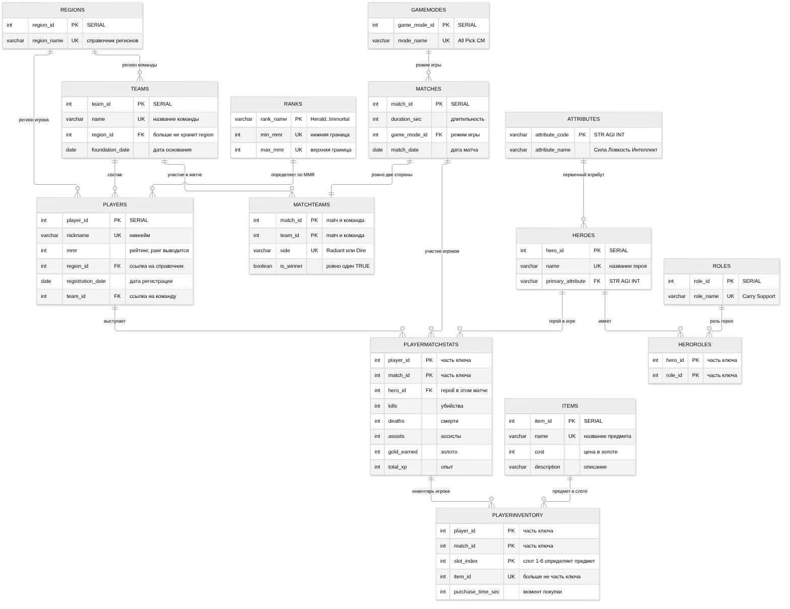

# Домашняя работа 3 — Нормализация до 3НФ и НФБК

**Предметная область:** Dota 2 (продолжение HW1, HW2)
**СУБД:** PostgreSQL 16
**Дедлайн:** 2 октября 2025

## Содержание

1. [Что было на входе](#1-что-было-на-входе)
2. [Разбор функциональных зависимостей](#2-разбор-функциональных-зависимостей)
3. [Найденные аномалии и как они решены](#3-найденные-аномалии-и-как-они-решены)
4. [Примеры, придуманные на своих таблицах](#4-примеры-придуманные-на-своих-таблицах)
5. [Итоговая схема и доказательство НФБК](#5-итоговая-схема-и-доказательство-нфбк)
6. [ER-диаграмма в НФ](#6-er-диаграмма-в-нф)
7. [Аномалии: сводная таблица «было / стало»](#7-аномалии-сводная-таблица-было--стало)
8. [Задачи к паре](#8-задачи-к-паре)
9. [Как воспроизвести](#9-как-воспроизвести)

---

## 1. Что было на входе

Схема из HW2 — 7 таблиц, 26 столбцов:

| Таблица | Столбцы |
|---|---|
| `Teams` | `team_id`, `name`, `region`, `foundation_date` |
| `Players` | `player_id`, `nickname`, `rank`, `region`, `registration_date`, `team_id`, `mmr` |
| `Heroes` | `hero_id`, `name`, `role`, `primary_attribute` |
| `Matches` | `match_id`, `duration_sec`, `winner_side`, `game_mode`, `match_date`, `radiant_team_id`, `dire_team_id` |
| `Items` | `item_id`, `name`, `cost`, `description` |
| `PlayerMatchStats` | `player_id`, `match_id`, `hero_id`, `kills`, `deaths`, `assists`, `gold_earned`, `total_xp` |
| `PlayerMatchItems` | `player_id`, `match_id`, `item_id`, `slot_index` |

Требования работы: довести схему до **3НФ** и **НФБК**, описать аномалии и способы их устранения, приложить новую ER-диаграмму. Поскольку в схеме HW2 нашлись настоящие нарушения, «придумывать» их не пришлось; дополнительно добавлены четыре собственные задачи в разделе 4 — они пригодятся, если на паре понадобится разбирать чужие примеры.

---

## 2. Разбор функциональных зависимостей

ФЗ записываются как `X → Y`, где `X` — детерминант, `Y` — зависимая часть.

### 2.1 `Players` — нарушение 3НФ (транзитивная зависимость)

```
player_id → nickname, rank, region, registration_date, team_id, mmr
mmr       → rank
```

`rank` зависит не от ключа напрямую, а через `mmr`: ранг звания — это функция от диапазона MMR. Значит `rank` транзитивно зависит от `player_id`:

```
player_id → mmr → rank
```

`rank` — непростой (не входит ни в один ключ-кандидат) атрибут, `mmr` — не ключ. Это классическое нарушение **3НФ**. Данные это подтверждают: в HW2 у игрока Miposhka стояло `rank = 'Divine'` при `mmr = 9800`, что по игровой лестнице соответствует Immortal. Два столбца хранили одно и то же значение и разошлись.

### 2.2 `Heroes` — нарушение 1НФ (составной атрибут)

```
hero_id → name, role, primary_attribute
```

Столбец `role` содержит `'Support/Roamer'` — два значения в одном поле. Атрибут неатомарен, это нарушение **1НФ**.

### 2.3 `Matches` — повторяющаяся группа

```
match_id → duration_sec, winner_side, game_mode, match_date,
           radiant_team_id, dire_team_id
```

Пара столбцов `radiant_team_id` / `dire_team_id` — это повторяющаяся группа: по смыслу это один и тот же факт «команда участвует в матче на стороне X», разложенный на две колонки. Список участников матча величина переменной длины (в матче всегда ровно две стороны, но модель «две колонки» не выражает сам факт участия), поэтому его нельзя ни хранить, ни обрабатывать запросами без частных случаев.

Дополнительно `winner_side` хранит **имя** стороны (`'Radiant'` / `'Dire'`) строкой. Это значение одновременно живёт в имени столбца, по которому определяется победитель, — двойное представление одного факта.

### 2.4 `PlayerMatchItems` — составной ключ выбран неверно

```
(player_id, match_id, item_id) → slot_index
```

Ключ объявлен как `(player_id, match_id, item_id)`. Но `slot_index` — это номер ячейки инвентаря, и он определяется парой «игрок + матч» плюс порядком покупки, а не предметом. Из-за того, что `item_id` входит в ключ, действуют одновременно две ФЗ:

```
(player_id, match_id, item_id)     → slot_index
(player_id, match_id, slot_index)  → item_id
```

То есть есть **два ключа-кандидата**, и они пересекаются. Само по себе это не нарушение НФБК (оба ФЗ имеют ключ-кандидат слева), но практически ключ выбран неверно: он запрещает ситуацию «купил два одинаковых предмета» (например, два Town Portal Scroll, что в игре разрешено), потому что второй такой предмет нарушит уникальность ключа. Порядок покупки — свойство позиции, а не идентичность предмета.

### 2.5 `Teams.region` и `Players.region` — дубль справочной величины

```
team_id   → name, region, foundation_date
player_id → nickname, rank, region, ...
```

`region` — справочная величина, повторяющаяся в двух таблицах и записываемая текстом. В данных HW2 видно, чем это заканчивается: регион Team Secret изначально был `'Western Europe'`, а после UPDATE стал `'Western Europe (EU)'`. Это два разных значения одного и того же региона — дубль и источник ошибок при фильтрации.

### 2.6 Что уже было в порядке

`PlayerMatchStats` — отношение в 3НФ изначально: ключ `(player_id, match_id)`, все неключевые атрибуты зависят от полного ключа, частичных и транзитивных зависимостей нет. `Items` тоже корректна: `item_id` определяет всё остальное, побочных зависимостей нет.

---

## 3. Найденные аномалии и как они решены

### 3.1 `Heroes.role` → `HeroRoles` (нарушение 1НФ)

**Аномалия.** Значение `'Support/Roamer'` составное. Спросить «кто саппорт?» нельзя запросом `WHERE role = 'Support'` — подстрока не равна значению. Любая правка требует переписывания строки целиком, и если вставить `'Support/Roamer'` вместо `'Support, Roamer'` в другом месте, получится два несовместимых формата. Нельзя посчитать, сколько героев на саппорте, не разбирая строки вручную.

**Решение.** Атрибут разложен на отдельную связь `HeroRoles(hero_id, role_id)` со справочником `Roles(role_id, role_name)`. Pudge теперь занимает две строки:

```
Pudge → Support
Pudge → Roamer
```

Аномалия обновления исчезает: роль задаётся и меняется по одной строке. Запрос становится честным: `SELECT ... FROM HeroRoles JOIN Roles WHERE role_name = 'Support'`. Добавление новой роли не требует правки существующих героев.

### 3.2 `Matches.radiant_team_id` / `dire_team_id` / `winner_side` → `MatchTeams` (повторяющаяся группа)

**Аномалия.** Структура «одна колонка на сторону» не масштабируется: матч на 4 стороны или матч без команд (тренировочный, Showmatch) потребовали бы новых столбцов. Нельзя выразить запрос «все матчи, где Team Spirit играла» без `WHERE radiant_team_id = X OR dire_team_id = X`. `winner_side` хранит сторону строкой, хотя победитель — это конкретная команда: чтобы узнать имя победителя, нужен дополнительный `CASE` с догадкой.

**Решение.** Создана таблица `MatchTeams(match_id, team_id, side, is_winner)` — по строке на каждую команду-участника. Сторона стала атрибутом со значением из списка (`CHECK (side IN ('Radiant','Dire'))`), победитель — булевым признаком `is_winner` на конкретной команде. Частичный уникальный индекс `ux_match_teams_one_winner` запрещает больше одного победителя на матч — это ограничение уровня набора строк, выразить его через `CHECK` нельзя.

Побочная выгода: «все матчи команды» — это один `JOIN`, без `OR`. Итог собирается представлением `v_match_results`, которое возвращает готовое имя победителя.

### 3.3 `Players.rank` → `Ranks` (транзитивная зависимость, нарушение 3НФ)

**Аномалия.** Данные это уже поймали: `Miposhka` имел `rank = 'Divine'` при `mmr = 9800`. Расхождение возникло из-за UPDATE в HW2 (`SET rank = 'Immortal'` для одного игрока, `SET mmr = 9800` для остальных) — два столбца обновлялись независимо. Появляется класс ошибок, который невозможно обнаружить средствами СУБД: `CHECK` на согласованность рангов пришлось бы писать вручную на каждую пару значений.

**Решение.** Столбец `rank` удалён из `Players`, остался только `mmr` — единственный источник правды. Лестница званий вынесена в справочник `Ranks(rank_name, min_mmr, max_mmr)`. Ранг вычисляется представлением `v_players_with_rank` через диапазон:

```sql
JOIN Ranks r ON p.mmr >= r.min_mmr AND p.mmr < r.max_mmr
```

Расхождение стало невозможным по построению. Миграция выводит расхождения отдельным отчётом, а не молча правит их — в нашем случае одна строка (`Miposhka`), и она видна в выводе `migrate_to_nf.sql`.

### 3.4 `region` в двух таблицах → справочник `Regions` (дубль)

**Аномалия.** `'Western Europe'` и `'Western Europe (EU)'` — один регион, записанный двумя способами. `WHERE region = 'Western Europe'` молча теряет Team Secret. Тот же регион пришлось бы обновлять в двух таблицах при каждом переименовании.

**Решение.** Создан справочник `Regions(region_id, region_name)` с `UNIQUE`, обе таблицы ссылаются на него через `region_id`. Переименование региона — один `UPDATE` в одной строке, ссылкам он не вредит. Миграция приводит оба написания к каноническому виду регулярным выражением, поэтому 4 региона из HW2 схлопываются в 3 корректных.

### 3.5 `PlayerMatchItems` → `PlayerInventory` (неверный ключ)

**Аномалия.** Из-за `item_id` в составе ключа нельзя записать, что игрок купил два одинаковых предмета, — второй вставкой будет ошибка уникальности, хотя в игре это разрешено. Порядок покупки (`slot_index`) при этом объявлен обычным столбцом, хотя именно он идентифицирует позицию.

**Решение.** Ключ перенесён на `(player_id, match_id, slot_index)` — слот в инвентаре действительно идентифицирует предмет. `item_id` стал неключевым атрибутом, и на паре «игрок + матч + предмет» добавлено ограничение `UNIQUE`, которое запрещает ровно то, что невозможно в игре (один и тот же предмет в двух слотах), и разрешает то, что возможно (два одинаковых предмета в разных слотах). Нормализация здесь не только про аномалии, но и про корректность модели.

---

## 4. Примеры, придуманные на своих таблицах

Собственные примеры на таблицах той же предметной области — на случай, если на паре понадобится разбирать чужие схемы.

### 4.1 Пример A — нарушение 3НФ через справочник

Гипотетическая денормализованная таблица для отчёта по командам:

```sql
CREATE TABLE TeamReport (
    team_id     INT PRIMARY KEY,
    team_name   VARCHAR(50),
    region      VARCHAR(30),
    country     VARCHAR(30),
    country_code CHAR(2)
);
```

ФЗ:

```
team_id → team_name, region, country, country_code
country → country_code
```

`country_code` транзитивно зависит от `team_id` через `country`:

```
team_id → country → country_code
```

**Аномалия.** `country` и `country_code` хранят один факт дважды. При входе страны в ЕС нужно обновить `country_code` во всех строках отчёта; если строк много и обновить не все — данные разойдутся, а СУБД этого не заметит.

**Решение.** Декомпозиция:

```sql
CREATE TABLE Countries (
    country      VARCHAR(30) PRIMARY KEY,
    country_code CHAR(2) UNIQUE
);

CREATE TABLE TeamReport (
    team_id   INT PRIMARY KEY,
    team_name VARCHAR(50),
    region    VARCHAR(30),
    country   VARCHAR(30) REFERENCES Countries(country)
);
```

В `Countries` ключ `{country}` определяет `country_code` — детерминант является ключом. В `TeamReport` все зависимости идут от `{team_id}`. Обе таблицы в НФБК.

### 4.2 Пример B — нарушение 1НФ через список в поле

```sql
CREATE TABLE Heroes_denorm (
    hero_id  INT PRIMARY KEY,
    name     VARCHAR(30),
    items    VARCHAR(200)   -- 'Black King Bar, Blink Dagger, Aghanim''s Scepter'
);
```

**Аномалия.** Список предметов в одном поле. Запрос «у кого есть Black King Bar» требует `LIKE '%Black King Bar%'`, который поймает и `'Black King Bar II'`. Удалить предмет из списка нельзя, не переписав всю строку и не разбирая её вручную. Длина поля ограничена: на 200 символов список упирается в обрыв строки.

**Решение.** Каждый предмет — отдельная строка:

```sql
CREATE TABLE HeroStartingItems (
    hero_id INT REFERENCES Heroes(hero_id),
    item_id INT REFERENCES Items(item_id),
    PRIMARY KEY (hero_id, item_id)
);
```

Атрибут стал атомарным, длина поля больше не ограничивает количество предметов, удаление одной строки не трогает остальные.

### 4.3 Пример C — отношение в 3НФ, но не в НФБК

Самый тонкий случай: формально 3НФ соблюдена, а НФБК — нет. Настоящая проверка начинается именно здесь.

```sql
CREATE TABLE HeroMatchPlays (
    player_id  INT,
    match_id   INT,
    hero_id    INT,
    hero_name  VARCHAR(30),
    kills      INT,
    PRIMARY KEY (player_id, match_id)
);
```

Бизнес-правила предметной области:

```
player_id, match_id → hero_id, hero_name, kills     -- выступление в матче
hero_id              → hero_name                     -- имя героя — свойство героя
match_id, hero_id    → player_id                     -- в одном матче герой уникален:
                                                        -- его не могут взять двое
```

Ключи-кандидаты: `{player_id, match_id}` и `{match_id, hero_id}`. Они пересекаются по `match_id`.

Простые (prime) атрибуты — те, что входят хотя бы в один ключ-кандидат: `player_id`, `match_id`, `hero_id` **и `hero_name`**.

**Проверка на 3НФ.** Для каждой нетривиальной ФЗ нужно: `X` — суперключ **или** `A` — простой атрибут.

| ФЗ | `X` суперключ? | `A` простой? | Итог |
|---|---|---|---|
| `{player_id, match_id} → hero_id` | да | — | ✓ |
| `{player_id, match_id} → kills` | да | — | ✓ |
| `hero_id → hero_name` | **нет** | **да** | ✓ |
| `{match_id, hero_id} → player_id` | да | — | ✓ |

Спорная зависимость одна: `hero_id → hero_name`. Детерминант `hero_id` — не суперключ (один герой играет во многих матчах), но `hero_name` **входит в ключ-кандидат** `{match_id, hero_id} → player_id` через `{match_id, hero_name}`, то есть является простым атрибутом. Второе условие 3НФ выполнено → **3НФ соблюдена**.

**Проверка на НФБК.** Требование жёстче: для каждой нетривиальной ФЗ детерминант `X` **обязан** быть суперключом. Льготы для простых атрибутов здесь нет.

| ФЗ | `X` суперключ? | Итог |
|---|---|---|
| `hero_id → hero_name` | **нет** | ✗ **нарушение НФБК** |

**Аномалия.** Название героя дублируется в каждой строке, где герой играл. Герой, сыгравший 500 матчей, хранит своё имя 500 раз. Смена названия героя в патче требует `UPDATE` по всем этим строкам; если одна строка упущена — в базе одновременно два имени одного героя, и СУБД этого не заметит.

**Решение.** Декомпозиция — вынести имя в справочник героев:

```sql
CREATE TABLE Heroes (
    hero_id   INT PRIMARY KEY,
    name      VARCHAR(30) UNIQUE
);

CREATE TABLE HeroMatchPlays (
    player_id INT,
    match_id  INT,
    hero_id   INT REFERENCES Heroes(hero_id),
    kills     INT,
    PRIMARY KEY (player_id, match_id)
);
```

**Значение для работы.** Если остановиться на проверке 3НФ, нарушение не обнаружится — определение 3НФ выполняется. Именно поэтому `MatchTeams` и `PlayerInventory` в итоговой схеме проверены на НФБК отдельно: у них по два пересекающихся ключа-кандидата, и это единственные места, где формальная проверка на 3НФ даёт не тот ответ, что НФБК.

### 4.4 Пример D — транзитивная зависимость внутри составного ключа

```sql
CREATE TABLE PlayerMatchHero (
    player_id INT,
    match_id  INT,
    hero_id   INT,
    hero_role VARCHAR(40),
    PRIMARY KEY (player_id, match_id)
);
```

ФЗ:

```
player_id, match_id → hero_id, hero_role
hero_id              → hero_role
```

**Аномалия.** `hero_role` зависит от `hero_id`, а не от пары «игрок + матч». Герой — это одна и та же сущность в разных матчах, и роль у него не меняется. Значит роль хранится и меняется в каждом матче, где играл герой. Смена роли героя в игре (патч) требует обновления всех строк.

**Решение.** Декомпозиция на `PlayerMatchStats(player_id, match_id, hero_id)` и `Heroes(hero_id, name, role, primary_attribute)`. Это ровно то, что уже сделано в итоговой схеме: роль вынесена в `HeroRoles`/`Roles`, а в `PlayerMatchStats` остался только `hero_id`.

---

## 5. Итоговая схема и доказательство НФБК

Нормализованные объекты размещены в схеме `nf`, чтобы не конфликтовать с таблицами HW2 в `public` — исходная схема остаётся для сравнения.

### 5.1 Таблицы

| Таблица | Ключ-кандидат | Назначение |
|---|---|---|
| `Regions` | `{region_id}`, `{region_name}` | справочник регионов |
| `Ranks` | `{rank_name}`, `{min_mmr}`, `{max_mmr}` | звания и диапазоны MMR |
| `Attributes` | `{attribute_code}` | справочник атрибутов героев |
| `Roles` | `{role_id}`, `{role_name}` | справочник ролей |
| `GameModes` | `{game_mode_id}`, `{mode_name}` | справочник режимов игры |
| `Teams` | `{team_id}`, `{name}` | команды |
| `Players` | `{player_id}`, `{nickname}` | игроки (без `rank`) |
| `Heroes` | `{hero_id}`, `{name}` | герои (без `role`) |
| `HeroRoles` | `{hero_id, role_id}` | связь герой ↔ роль |
| `Items` | `{item_id}`, `{name}` | предметы |
| `Matches` | `{match_id}` | матчи (без сторон) |
| `MatchTeams` | `{match_id, team_id}`, `{match_id, side}` | команды в матче |
| `PlayerMatchStats` | `{player_id, match_id}` | статистика игрока в матче |
| `PlayerInventory` | `{player_id, match_id, slot_index}`, `{player_id, match_id, item_id}` | инвентарь |

### 5.2 Проверка каждой таблицы на НФБК

Для каждой таблицы приведены нетривиальные ФЗ и ключи-кандидаты. НФБК требует: в каждой нетривиальной ФЗ детерминант — суперключ.

**`Regions`** — `region_id → region_name`; `region_name → region_id`. Оба детерминанта — простые ключи. **НФБК.**

**`Ranks`** — `rank_name → min_mmr, max_mmr`; `min_mmr → rank_name, max_mmr`; `max_mmr → rank_name, min_mmr`. Ключи-кандидаты: `{rank_name}`, `{min_mmr}`, `{max_mmr}` (все три столбца объявлены `UNIQUE`). Каждый детерминант — ключ. Транзитивных зависимостей нет, поэтому и 3НФ соблюдена. **НФБК.**

**`Attributes`** — `attribute_code → attribute_name`. Детерминант — ключ. **НФБК.**

**`Roles`** — `role_id → role_name`; `role_name → role_id`. Оба — ключи. **НФБК.**

**`GameModes`** — `game_mode_id → mode_name`; `mode_name → game_mode_id`. Оба — ключи. **НФБК.**

**`Teams`** — `team_id → name, region_id, foundation_date`; `name → team_id, region_id, foundation_date`. Оба детерминанта — ключи. Транзитивных зависимостей нет: `region_id` определяет `region_name`, но `region_name` здесь не хранится. **НФБК.**

**`Players`** — `player_id → nickname, mmr, region_id, registration_date, team_id`; `nickname → player_id, ...`. Оба детерминанта — ключи. Транзитивная зависимость `rank ← mmr` устранена удалением `rank`. **НФБК.**

**`Heroes`** — `hero_id → name, primary_attribute`; `name → ...`. Оба — ключи. Составной атрибут `role` устранён. **НФБК.**

**`HeroRoles`** — `hero_id, role_id → ∅` (нетривиальных ФЗ нет). Отношение состоит только из атрибутов ключа, что даёт как 3НФ, так и НФБК. **НФБК.**

**`Items`** — `item_id → name, cost, description`; `name → item_id, cost, description`. Оба — ключи. **НФБК.**

**`Matches`** — `match_id → duration_sec, game_mode_id, match_date`. Единственный детерминант — ключ. Побочные зависимости убраны в `MatchTeams`. **НФБК.**

**`MatchTeams`** — ключи-кандидаты `{match_id, team_id}` и `{match_id, side}`, они пересекаются по `match_id`. Нетривиальные ФЗ:

```
match_id, team_id → side, is_winner
match_id, side    → team_id, is_winner
```

Оба детерминанта — ключи-кандидаты, ни одна нетривиальная ФЗ не начинается с не-ключевого множества. Именно этот случай (пересекающиеся ключи) и отличает НФБК от 3НФ, поэтому он проверен отдельно. **НФБК.**

**`PlayerMatchStats`** — `(player_id, match_id) → hero_id, kills, deaths, assists, gold_earned, total_xp`. Единственный ключ-кандидат — составной. Частичных зависимостей нет (все атрибуты зависят от обоих столбцов ключа) → **2НФ**. Транзитивных нет: `hero_id` определяет `Heroes.name`, но `name` здесь не хранится → **3НФ**. Единственная нетривиальная ФЗ начинается с ключа → **НФБК.**

**`PlayerInventory`** — ключи-кандидаты `{player_id, match_id, slot_index}` и `{player_id, match_id, item_id}`, пересекаются. Нетривиальные ФЗ:

```
player_id, match_id, slot_index → item_id, purchase_time_sec
player_id, match_id, item_id     → slot_index, purchase_time_sec
```

Оба детерминанта — ключи-кандидаты. Проверка на 2НФ: `purchase_time_sec` зависит от всей тройки ключа, частичной зависимости нет — покупка привязана к конкретному слоту в конкретном матче. **НФБК.**

**Итог: все 14 таблиц находятся в НФБК, следовательно, и в 3НФ** (НФБК строже 3НФ).

### 5.3 Что осталось снаружи базы

- `rank` игрока — представление `v_players_with_rank`, выводится из MMR.
- Итог матча с именами команд и победителя — представление `v_match_results`.

Оба вычисляются, а не хранятся: материализовать их значило бы вернуть дублирование, которое только что убрано.

---

## 6. ER-диаграмма в НФ



Исходник диаграммы — `diagram.mmd` (Mermaid), рендер воспроизводится командой из раздела 9.

Что изменилось по сравнению с HW1:

| Было | Стало | Причина |
|---|---|---|
| `Players.region` (текст) | `Regions.region_name` + FK | справочник вместо дубля |
| `Teams.region` (текст) | `Regions` + FK | то же самое |
| `Players.rank` (текст) | `Ranks` по диапазону MMR | транзитивная зависимость |
| `Heroes.role` (текст) | `HeroRoles` + `Roles` | составной атрибут, 1НФ |
| `Matches.radiant_team_id`, `dire_team_id` | `MatchTeams` | повторяющаяся группа |
| `Matches.winner_side` | `MatchTeams.is_winner` | двойное представление факта |
| `PlayerMatchItems` | `PlayerInventory` | `slot_index` в ключе |
| `game_mode` (текст) | `GameModes` + FK | справочник |

Связи в нормализованной схеме:

| От | К | Тип |
|---|---|---|
| `Regions` | `Teams` | 1 : N |
| `Regions` | `Players` | 1 : N |
| `Teams` | `Players` | 1 : N |
| `Teams` | `MatchTeams` | 1 : N |
| `Matches` | `MatchTeams` | 1 : ровно 2 |
| `GameModes` | `Matches` | 1 : N |
| `Attributes` | `Heroes` | 1 : N |
| `Heroes` | `HeroRoles` | 1 : N |
| `Roles` | `HeroRoles` | 1 : N |
| `Matches` | `PlayerMatchStats` | 1 : N |
| `Players` | `PlayerMatchStats` | 1 : N |
| `Heroes` | `PlayerMatchStats` | 1 : N |
| `PlayerMatchStats` | `PlayerInventory` | 1 : N |
| `Items` | `PlayerInventory` | 1 : N |

Связь `Ranks` c `Players` на диаграмме показана пунктиром: она не выражается внешним ключом, ранг выводится через диапазон MMR. Это единственная связь без FK в схеме — и она появляется именно потому, что хранить `rank` было бы нарушением 3НФ.

---

## 7. Аномалии: сводная таблица «было / стало»

| Аномалия | Где | Тип | Решение |
|---|---|---|---|
| Неатомарное значение `'Support/Roamer'` | `Heroes.role` | 1НФ | `HeroRoles` + `Roles` |
| Повторяющаяся группа «колонка на сторону» | `Matches` | 1НФ | `MatchTeams` |
| `rank` зависит от `mmr`, а не от ключа | `Players` | 3НФ (транзитивная) | `Ranks`, ранг — представление |
| Регион записан двумя способами | `Teams`, `Players` | дубль справочника | `Regions` + FK |
| Имя стороны как данные | `Matches.winner_side` | двойное представление | `MatchTeams.is_winner` |
| Один предмет нельзя купить дважды | `PlayerMatchItems` ключ | неверный ключ | `PlayerInventory`, слот в ключе |
| Расхождение `rank='Divine'` при `mmr=9800` | `Players` | рассогласование | невозможно по построению |

Последняя строка — не гипотетическая: расхождение было в реальных данных HW2 и обнаружено миграцией.

---

## 8. Задачи к паре

Подготовлены четыре задачи на нормализацию. Условие общее: сначала проверить 2НФ, затем 3НФ, затем НФБК. Ответы приведены сразу под условием — их лучше скрыть, чтобы на паре разобрать задачи с нуля.

### Задача 1

```
Championships(champ_id PK, name, country, country_code, founded_year, budget)
```
ФЗ: `champ_id → name, country, country_code, founded_year, budget`; `country → country_code`.

Вопрос: какая нормальная форма и что декомпозировать?

**Ответ.** Транзитивная зависимость `country_code ← country ← champ_id`: 2НФ соблюдена (ключ простой), **3НФ нарушена**. Декомпозиция на `Countries(country PK, country_code UK)` и `Championships(champ_id PK, name, country FK, founded_year, budget)`. Обе таблицы в НФБК.

### Задача 2

```
Matches(match_id PK, team_a, team_b, winner_team, winner_side, duration, mode)
```
Победитель всегда одна из двух команд. `winner_side` ∈ {`A`, `B`}.

Вопрос: что здесь не так и как исправить?

**Ответ.** `winner_side` определяется через `winner_team`, а дублирует его: победитель — это команда, а сторона выводится сравнением. Плюс повторяющаяся группа «две команды». Декомпозиция на `Matches(match_id PK, duration, mode)` и `MatchTeams(match_id, team_id, side, is_winner, PK(match_id, team_id), UK(match_id, side))`. Ограничение «ровно один победитель» — частичный уникальный индекс.

### Задача 3

```
ItemBuilds(item_id, tier, tier_min_cost, tier_max_cost, cost, PK(item_id))
```
ФЗ: `item_id → tier, tier_min_cost, tier_max_cost, cost`; `cost → tier` (предметы дороже порога относятся к высшему тиру); `tier → tier_min_cost, tier_max_cost`.

Вопрос: 3НФ? НФБК?

**Ответ.** Ключ `{item_id}` простой, частичных зависимостей нет → 2НФ. `tier`, `tier_min_cost`, `tier_max_cost` транзитивно зависят от `item_id` через `cost` → **3НФ нарушена**. Декомпозиция: `ItemTiers(tier PK, tier_min_cost, tier_max_cost)` и `ItemBuilds(item_id PK, cost, tier FK)`. После декомпозиции **НФБК**.

### Задача 4 (на разницу между 3НФ и НФБК)

```
HeroMatchPlays(player_id, match_id, hero_id, hero_name, kills,
                PK(player_id, match_id))
```
ФЗ:
```
player_id, match_id → hero_id, hero_name, kills
hero_id              → hero_name
match_id, hero_id    → player_id     -- в одном матче герой уникален
```

Вопрос: нарушение есть? Если да — какой это формы?

**Ответ.** Нарушение есть, и оно **именно НФБК, а не 3НФ**.

Ключи-кандидаты: `{player_id, match_id}` и `{match_id, hero_id}`. Простые атрибуты — `player_id`, `match_id`, `hero_id` и `hero_name`: последний входит в ключ-кандидат `{match_id, hero_name}`.

- **3НФ соблюдена.** Единственная спорная ФЗ — `hero_id → hero_name`. Её детерминант `hero_id` не суперключ, но зависимый атрибут `hero_name` простой → второе условие определения 3НФ выполнено. Формально всё чисто.
- **НФБК нарушена.** Для `hero_id → hero_name` детерминант обязан быть суперключом. `hero_id` — не суперключ (один герой играет во многих матчах) → нарушение.

Аномалия: имя героя дублируется в каждой строке, где он играл; переименование героя требует массового `UPDATE`.

Решение: вынести имя в `Heroes(hero_id PK, name UNIQUE)`, оставив в `HeroMatchPlays` только `player_id`, `match_id`, `hero_id`, `kills`. После декомпозиции — НФБК.

---

## 9. Как воспроизвести

```bash
# 1. База со схемой HW2 и её данными (берём из репозитория)
psql -h 127.0.0.1 -U timerlan -d dota2_hw -f ../HW2/create_tables.sql
psql -h 127.0.0.1 -U timerlan -d dota2_hw -f ../HW2/alter_tables.sql
psql -h 127.0.0.1 -U timerlan -d dota2_hw -f ../HW2/insert_data.sql
psql -h 127.0.0.1 -U timerlan -d dota2_hw -f ../HW2/update_data.sql

# 2. Нормализованная схема в 3НФ/НФБК (схема nf)
psql -h 127.0.0.1 -U timerlan -d dota2_hw -f normalized_schema.sql

# 3. Перенос данных и проверка целостности
psql -h 127.0.0.1 -U timerlan -d dota2_hw -f migrate_to_nf.sql

# 4. Проверка результата
psql -h 127.0.0.1 -U timerlan -d dota2_hw -c "SELECT * FROM nf.v_match_results ORDER BY match_id;"
psql -h 127.0.0.1 -U timerlan -d dota2_hw -c "SELECT * FROM nf.v_players_with_rank ORDER BY player_id;"
```

Рендер ER-диаграммы:

```bash
npx --yes @mermaid-js/mermaid-cli -i diagram.mmd -o ER_diagram_nf.png -b white -s 2
```

Все скрипты проверены на PostgreSQL 16: схема создаётся, данные переносятся без потерь, блок проверки целостности в конце `migrate_to_nf.sql` подтверждает, что ни одна строка не потеряна, каждый игрок попадает ровно в один диапазон MMR, а в каждом матче ровно один победитель.